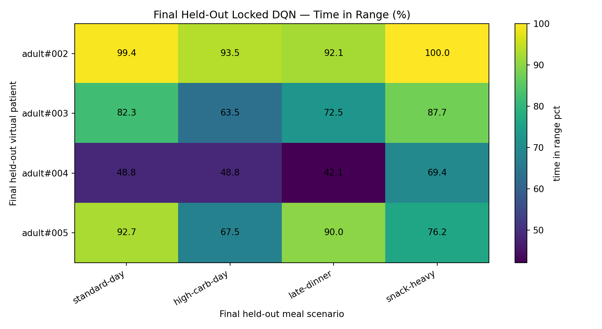
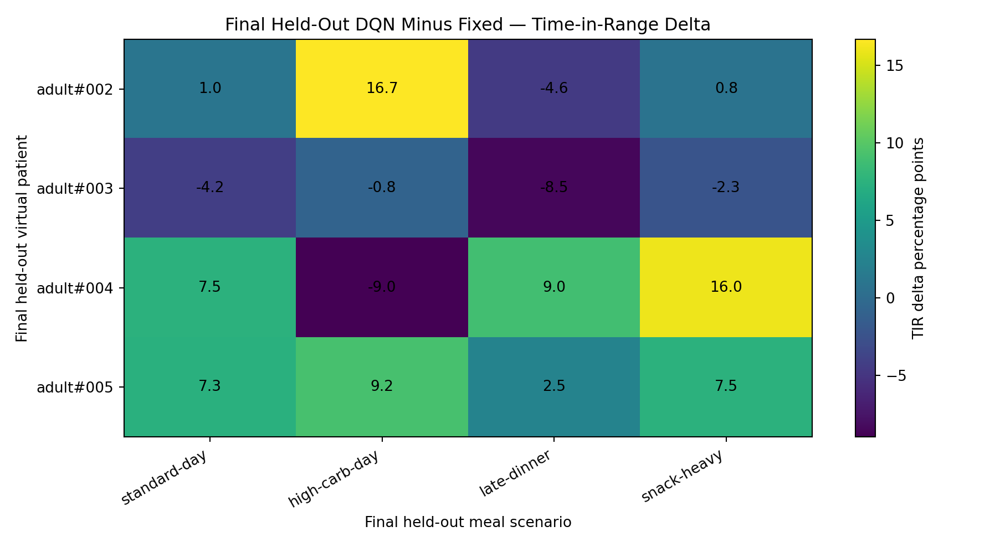
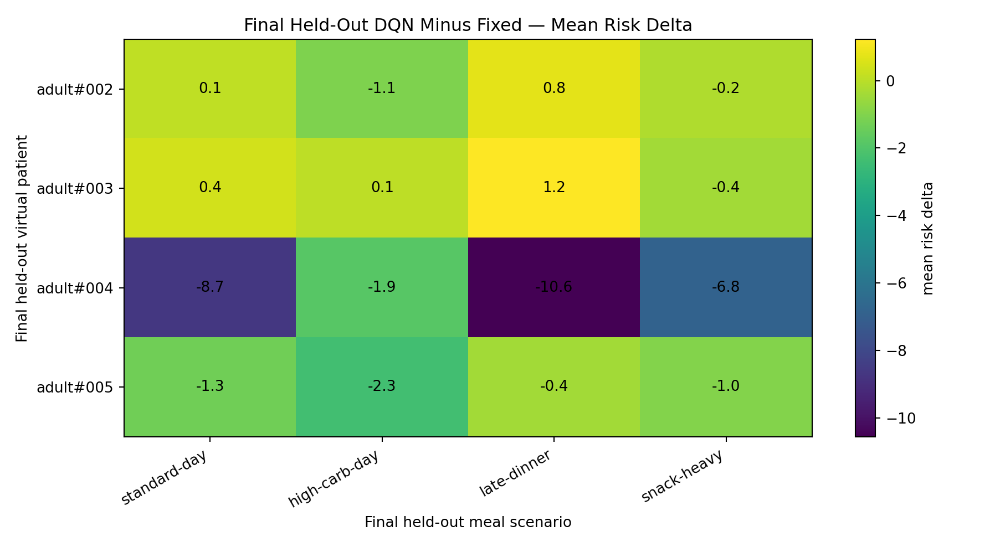
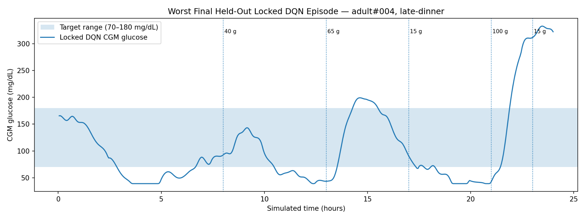
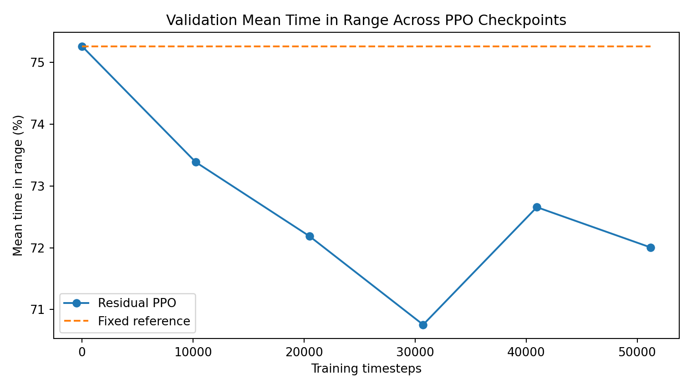
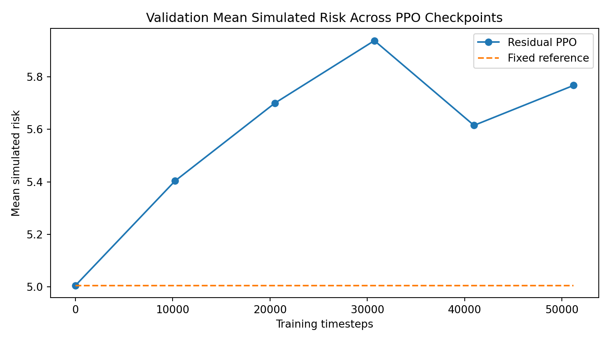

# GlucoPilot-RL

**Research simulation for blood glucose control with reinforcement learning.**

GlucoPilot-RL is a reinforcement learning project that studies simulated insulin-like control decisions for virtual Type 1 Diabetes patients. The project compares fixed-action control, continuous PPO variants, and a final safety-shielded discrete DQN controller inside the `simglucose` virtual-patient simulator.

> **Medical safety notice**  
> This repository is for research and educational simulation only. It is **not** a medical device, not a treatment recommendation, and must not be used for real insulin dosing or clinical decision-making.

---

## Final result

The final model was locked **before** opening the final held-out evaluation suite. It was then evaluated once on 16 unseen virtual-patient/scenario combinations.

| Metric | Fixed baseline | Locked shielded DQN | Change |
|---|---:|---:|---:|
| Mean time in range | `73.65%` | `76.65%` | `+3.01` percentage points |
| Mean simulated risk | `7.5494` | `5.5441` | `-2.0053` |
| Worst below-range exposure | `66.88%` | `43.75%` | improved |
| Worst very-low exposure | `55.62%` | `27.08%` | improved |
| Mean safety-shield intervention rate | `—` | `28.22%` | — |

The locked shielded DQN improved average time in range and reduced mean simulated risk on the final held-out suite. It also reduced the worst low-glucose exposure compared with the fixed baseline. However, the worst-case trace still shows clinically unsafe simulated behavior, so the project should be presented as a research prototype rather than a deployable medical controller.

---

## Final held-out visualizations

### Final time in range



### DQN minus fixed baseline: time-in-range delta



### DQN minus fixed baseline: mean risk delta



### Worst final held-out DQN episode



---

## Why this project is interesting

This project is not just a single training run. It follows a research-style workflow:

1. Build a reproducible fixed-action baseline.
2. Show that a tuned fixed action fails to generalize across virtual patients.
3. Test a continuous PPO controller.
4. Redesign PPO as a normalized residual controller.
5. Add meal-aware observations.
6. Switch to a discrete action space.
7. Add a safety shield.
8. Train DQN with validation-only checkpoint selection.
9. Lock the selected model.
10. Evaluate exactly once on the final held-out suite.

This makes the project stronger for a portfolio because it demonstrates experimentation, failure analysis, validation discipline, and honest reporting.

---

## Methods

### Environment

- Simulator: `simglucose`
- Virtual patient family: adult virtual patients
- Episode length: 24 simulated hours
- CGM sampling interval: 3 minutes
- Final held-out cases: 16 unseen patient/scenario combinations

### Action design

The final controller uses a small discrete residual action space around a tuned fixed reference action:

```text
[-1.00, -0.75, -0.50, -0.25, 0.00, +0.25, +0.50, +1.00]
```

The neutral residual action reproduces the fixed-action baseline. A rule-based safety shield can override obviously unsafe directions, such as adding action when simulated glucose is already low.

### Model

- Algorithm: DQN
- Controller type: safety-shielded discrete residual policy
- Selection method: validation-only checkpoint selection
- Final model: locked DQN checkpoint at 10,240 training timesteps

---

## Validation before final testing

The DQN checkpoint at 10,240 timesteps was chosen based on validation analysis before the final held-out suite was opened.

| Validation metric | Neutral shield | DQN checkpoint 10,240 |
|---|---:|---:|
| Mean time in range | `75.23%` | `79.79%` |
| Mean TIR delta | `-0.03` pp | `+4.53` pp |
| Mean simulated risk | `5.0101` | `3.7104` |
| Mean risk delta | `+0.0044` | `-1.2952` |
| Max below range | `2.71%` | `5.00%` |
| Max very low | `0.00%` | `0.00%` |

The validation result was promising but showed a trade-off: better mean performance with slightly higher below-range exposure in some validation cases. This is why the final report explicitly avoids medical claims.





---

## Project structure

```text
GlucoPilot-RL/
├── docs/
│   ├── assets/
│   ├── results/
│   ├── PROJECT_REPORT.md
│   └── RESUME_SNIPPET.md
├── models/
├── outputs/
├── scripts/
├── src/
│   └── glucopilot_rl/
├── requirements.txt
├── pyproject.toml
└── README.md
```

---

## Reproduce the final workflow

Create and activate a virtual environment:

```bat
py -m venv .venv
.venv\Scripts\activate
python -m pip install --upgrade pip setuptools wheel
python -m pip install -r requirements.txt
```

Run the environment check:

```bat
python scripts\check_environment.py
```

Evaluate the fixed baseline:

```bat
python scripts\evaluate_fixed_basal.py
```

Evaluate baseline generalization:

```bat
python scripts\evaluate_baseline_generalization.py
```

Run the safety-shield checks:

```bat
python scripts\check_discrete_safety_shield.py
python scripts\evaluate_discrete_shield_validation.py
```

Train DQN with validation checkpoint selection:

```bat
python scripts\train_dqn_discrete_with_validation_selection.py --total-timesteps 51200 --checkpoint-every 10240 --run-name dqn_discrete_shield_selection_51k
```

Lock the selected checkpoint:

```bat
python scripts\lock_dqn_checkpoint.py --source models\dqn_discrete_shield_selection_51k\dqn_discrete_shield_selection_51k_step-010240.zip --locked-name dqn_discrete_shield_locked_010240
```

Run the final held-out evaluation once:

```bat
python scripts\evaluate_locked_dqn_final.py --model models\dqn_discrete_shield_locked_010240.zip --run-name dqn_discrete_shield_locked_010240
```

---

## Limitations

- This is a simulation-only project.
- The policy is not clinically validated.
- The reward function and safety shield are manually designed.
- The final worst-case trace still contains unsafe glucose behavior.
- The model should not be used outside the virtual-patient simulator.

---

## Suggested citation / disclaimer

If you use or present this repository, describe it as:

> A research simulation of safety-shielded reinforcement learning for virtual blood glucose control, evaluated on held-out virtual patients. Not intended for medical decision-making.

---

## License

This project is released under the MIT License. See [LICENSE](LICENSE) for details.
